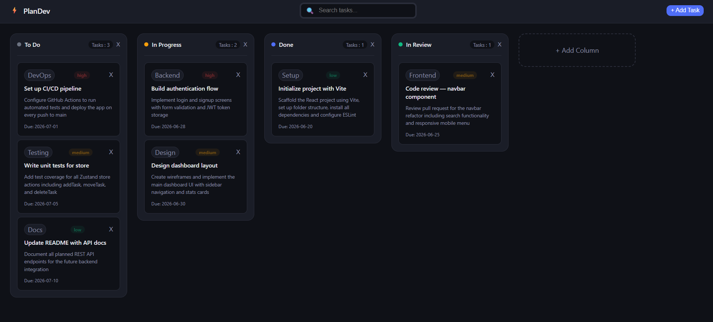

# ⚡ PlanDev

PlanDev is a modern Kanban board built for developers and teams to organize, prioritize, and track their work. It features a clean dark UI, drag-and-drop task management, dynamic column creation, and persistent storage — all without a backend.

🚀 **Live Demo:** [plan-dev.vercel.app](https://plan-dev.vercel.app)



## Features

- **Drag and drop** — move task cards between columns with smooth drag-and-drop interaction
- **Rich task details** — each task holds a title, description, priority level (high/medium/low), label, and due date
- **Dynamic priority colors** — task priority badges are color-coded automatically: red for high, amber for medium, green for low
- **Custom columns** — add new columns with a title and a custom color, or delete existing ones (cascades to delete all tasks inside)
- **Task management** — add tasks through a modal form, delete individual tasks with a single click
- **Persistent storage** — all board data is saved to localStorage and survives page refreshes automatically
- **Responsive layout** — columns wrap to the next row when horizontal space runs out, no awkward scrollbars

## Tech Stack

- **React 19** — component architecture, hooks, controlled inputs
- **Vite** — fast development server and production bundler
- **Zustand v5** — global state management with persist middleware
- **dnd-kit** — drag-and-drop with collision detection
- **CSS Custom Properties** — design system built entirely with CSS variables, no UI framework

## Getting Started

```bash
# Clone the repository
git clone https://github.com/rudhransh798/plandev.git

# Navigate into the project
cd plandev

# Install dependencies
npm install

# Start the development server
npm run dev
```

Then open `http://localhost:5173` in your browser.

## Project Structure

```
src/

├── components/

│   ├── Navbar/        # Top bar with search and add task button

│   ├── Board/         # Main board container with drag context

│   ├── Column/        # Individual column with droppable zone

│   ├── Card/          # Task card with draggable behavior

│   ├── Modal/         # Add task form modal

│   └── AddColumn/     # Inline add column form with color picker

├── store/

│   └── useBoardStore.js   # Zustand store — all state and actions

└── index.css              # Global design system with CSS variables

```

## What I Learned

**CSS Custom Properties** — before this project I would have hardcoded color values everywhere. Now I understand why CSS variables exist — the entire app's color scheme, spacing scale, and border radii are defined once in `:root` and referenced everywhere. Changing a single variable updates every element that uses it instantly.

**Event bubbling and pointer events** — when building the delete button on task cards, clicking delete was accidentally triggering the drag-and-drop behavior. I learned that a click event is actually a sequence of events — `pointerdown` fires first, then `mouseup`, then `click`. Since dnd-kit listens on `pointerdown`, I had to stop propagation at that level specifically, not just on the click handler. This taught me to think about event firing order rather than just attaching handlers and hoping for the best.

**Component state vs global state** — building the modal taught me the difference between UI state that belongs to one component (whether the modal is open) and application state that belongs to the whole app (the list of tasks). The modal's open/closed state lives in `App.jsx` as a simple `useState` boolean. The tasks themselves live in Zustand because any component might need them. Knowing where to put state is one of the most important decisions in React architecture.

**Zustand and normalized state** — understanding Zustand was the most challenging part of this project. At first I didn't understand how components could access global state without passing props everywhere. Once I learned that Zustand creates a store outside the React tree that any component can subscribe to directly, everything clicked. I also learned to model data in a normalized shape — tasks stored as a lookup table by ID, columns holding arrays of task IDs rather than full task objects — which makes updates fast and avoids data duplication.

## Upcoming Features

- [ ] Search and filter tasks by title or label
- [ ] Edit existing tasks
- [ ] Drag to reorder columns

